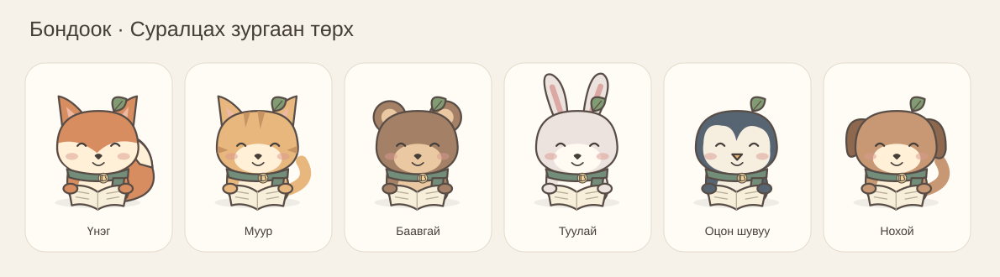
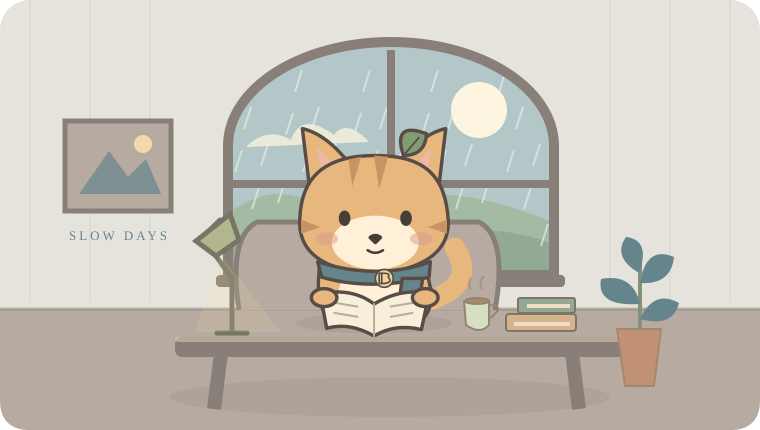
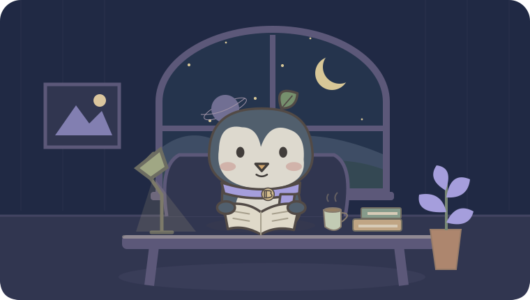

# Тогтмол v5 — Бондооктой хамт суралцъя

**Өөрийн хэмнэлээр, нэг жижиг алхам.**

Бондоок хамтрагчтай суралцах өрөө: хичээлээ хэмжих, тэмдэглэл ба зургаа хадгалах, картаар давтах, сорил өгөх, зорилгоо жижиг алхам болгох хувийн орон зай.



## v5-д юу өөрчлөгдсөн бэ?

- **Шинэ нүүр:** өнөөдрийн зурагтай тэмдэглэл, давтах карт, Бондоокийн булан.
- **Миний мэдлэг:** тэмдэглэл, зураг, шошго, хичээл, холбоос, картын багц, сорил, хичээлийн түүхийг нэг дор хайж шүүнэ. `Ctrl / ⌘ K` бүх мэдээллийн хайлтыг нээнэ.
- **Картын давтлага:** асуулт → санах → хариулт → 0–5 үнэлгээ. SM-2 арга дараагийн өдрийг тооцож, давтлага бүрийн түүхийг хадгална. Багц, картуудыг засаж, хогийн савнаас сэргээж болно.
- **Сорил:** сонгох, үнэн/худал, богино хариулт. Үр дүн ба тухайн үеийн асуултууд хадгалагдана. Буруу хариултуудаар картаа өөрөө үүсгэж болно.
- **Бондоок:** зургаан төрх, долоон төлөв, хувцас, жижиг чимэглэл. Ярилцлага хадгалагдана. Төхөөрөмж дээр бодит хугацаа, төлөвлөгөө, тэмдэглэл, давтлагаас дүгнэлт өгнө.
- **Онлайн санал:** хэрэглэгчийн сонгосон текст/тэмдэглэл/зураг → засаж болох карт; зорилго ба боломжит цаг → засаж болох төлөвлөгөө. Зөвшөөрөл болон серверийн тохиргоо шаардлагатай. Хадгалах товч дарахаас өмнө шинэ карт, төлөвлөгөө үүсгэхгүй.
- **10 өрөө:** Cozy Cat, Forest, Night Study, Sakura, Minimal дээр Rainy Cafe, Space Study, Mountain Cabin, Library, Ocean Calm нэмсэн. Өрөө, орчин, өнгө, чимэглэл, зарим бичгийн хэв, санал болгох ая өөрчлөгдөнө.
- **9 ая/чимээ:** төхөөрөмж дээр үүсгэдэг хөгжмийн сонголтод White Noise, Deep Focus нэмсэн. Жижиг тоглуулагч багасгах, томруулах, хуудас солих үед үргэлжилнэ; Play/Pause, Volume, Expand, Stop удирдлагатай. YouTube зөвхөн албан ёсны ил харагдах тоглуулагчаар ажиллана.
- **Хугацаа ба сануулга:** дэмждэг төхөөрөмжид дэлгэц сэрүүн байлгах, дуусах дохионы түвшин, суралцах өдөр эхлэх цаг, 0–2 амралтын өдөр, карт/төлөвлөгөө/зорилгын нэгтгэсэн сануулга.
- **Нууцлал ба өгөгдөл:** бүрэн JSON нөөц, өдөр тутмын автомат нөөц, сэргээх дэлгэц, AI болон синк унтраах, локал/үүлэн хуулбарыг баталгаажуулж цэвэрлэх. Устгасны дараа хуучин төхөөрөмжийн мэдээллийг зөвшөөрөлгүй буцааж байршуулахгүй.

Өмнөх хичээл, календарь, stopwatch/Pomodoro, түр зогсоох/үргэлжлүүлэх, зорилго ба үе шат, төлөвлөгөө, хэмжсэн ахиц, өрөөний урамшуулал, статистик, бүртгэл ба нөөцийн боломжууд хадгалагдсан. [v4.1-ийн түүх](docs/UPGRADE-4.1.md).

| Rainy Cafe                                | Space Study                              |
| ----------------------------------------- | ---------------------------------------- |
|  |  |

| Mountain Cabin                           | Library                                 | Ocean Calm                              |
| ---------------------------------------- | --------------------------------------- | --------------------------------------- |
|  |  |  |

Эдгээр нь аппын өөрийн SVG зургууд; браузерын бүтэн дэлгэцийн зураг биш.

## Ажиллуулах

Node.js **24** ашиглана.

```bash
git clone https://github.com/AriukagiinTuvshoo/TOGTMOL.git
cd TOGTMOL
npm ci
npm run dev
```

Браузераар `http://localhost:3000` нээнэ. **Хичээлүүд → Хичээл нэмэх → Миний өрөө → Start study**. Тэмдэглэл болон картын хувьд **Миний мэдлэг** хэсгээс эхэлнэ.

Supabase, AI түлхүүргүй үед үндсэн апп төхөөрөмж дээр ажиллана. Онлайн AI болон зураг уншуулах боломж түлхүүргүй үед ажиллахгүй; текстээс энгийн картын загвар бэлдэж болно. Төхөөрөмж дээрх загвар нь AI эсвэл зураг таних хөдөлгүүр биш.

```bash
npm run build
npm start
```

Next.js төсөл тул HTML файл шиг давхар дарж нээхгүй. Өмнөх дан HTML нь `legacy/togtmol-v2.html` дотор бий. GitHub эх кодыг хадгална; интернетэд ажиллуулахад Node.js/Next.js дэмждэг сервер хэрэгтэй.

## Өгөгдлөө шилжүүлэх

Ижил браузер, домэйн дээр v2/v3/v4 өгөгдлийг **эх хадгалалтыг нөөцөлсний дараа** v5 руу шилжүүлнэ. IndexedDB-ийн нэр `togtmol-v3` хэвээр; дотоод хувилбар 2 болж, мэдлэгийн бичлэгүүд тусдаа хадгалагдана. Зургийг дууны түвшин өөрчлөх бүрд дахин бичихгүй.

Өөр браузер/домэйн/порт ашиглах бол хуучин хувилбараас JSON экспортлоод **Тохиргоо → JSON файл нэгтгэх** хэсэгт оруулна. v5 экспорт `app: "togtmol"`, `version: 5`, `data` талбартай. Хуучин үйлчлүүлэгч v5 файлыг уншихгүй. Эх өгөгдөл эвдэрсэн үед сэргээх цонх эх файлыг татах, нөөц сонгох, дахин оролдох боломж өгнө.

[Шилжилт ба сэргээх](docs/MIGRATION.md) · [Архитектур](docs/ARCHITECTURE.md) · [v5-ийн инженерийн тэмдэглэл](docs/UPGRADE-5.md).

## Үүлэн хадгалалт ба онлайн Бондоок

Бодит Supabase санд **v5 SQL шинэчлэлтийг хэрэглэж байж** v5 синк ажиллана. `supabase/migrations/` дахь гурван файлыг дарааллаар нь хэрэглэнэ; v4 санд зөвхөн `20260921155351_knowledge_world_v5.sql` нэмэгдэнэ. [Байршуулах заавар](docs/DEPLOYMENT.md).

Онлайн Бондоокт серверийн `OPENAI_API_KEY`, `OPENAI_MODEL`, `BONDOOK_AI_ALLOWED_USER_IDS` тохируулна. Өдөрт нэг хэрэглэгчид нийт 20 онлайн хүсэлт зөвшөөрнө. Дуугаар бичихийг асаахдаа серверийн `CHIMEGE_API_TOKEN`-ийг secret хэлбэрээр тохируулна; хэрэглэгчийн эрхийн жагсаалт `CHIMEGE_ALLOWED_USER_IDS`-ээс, хоосон бол `BONDOOK_AI_ALLOWED_USER_IDS`-ээс уншигдана. Дуугаар бичсэн хүсэлт мөн өдөр тутмын 20-ын хязгаарт тооцогдоно. Түлхүүрүүд GitHub болон браузерын кодод орох ёсгүй. Зураг ашиглах бол сонгосон загвар зураг болон бүтэцтэй хариу дэмждэг байх шаардлагатай.

## Шалгах

```bash
npm run check
npm run format:check
npm run build
```

`check` нь TypeScript, ESLint, бүх тест, production build-ийг ажиллуулна. [Шалгалтын тайлан](docs/VERIFICATION.md)-д бодитоор шалгасан зүйл болон үлдсэн төхөөрөмж/үйлчилгээний шалгалтуудыг бичсэн.

[Хөгжмийн засвар, шалгалт ба хязгаар](docs/MUSIC.md).

Өрөөний баримтын зургийг дахин үүсгэх: `node scripts/render-room-previews.mjs`.

## Бодит хязгаар

- Байршуулсан Supabase, AI үйлчилгээ, Google нэвтрэлтийг бодит түлхүүртэй орчинд хараахан шалгаагүй.
- Браузерын дүрслэл болон жинхэнэ YouTube тоглолтыг энэ орчинд бүрэн баталгаажуулаагүй. Зураг, бүрэлдэхүүн, өгөгдөл, SQL-ийн тестүүд үүнийг орлохгүй.
- iOS/Android дээр түгжээтэй дэлгэцийн дуу, мэдэгдэл болон апп хаагдсан үеийн хөгжмийг батлахгүй. Буцаж нээхэд цагийг хадгалсан мөчөөс нь тооцно. YouTube-ийг багасгахад дүрс нь жижиг тоглуулагчид үлдэнэ; дотоод хуудас солиход дахин эхлэхгүй. Арын горимыг браузер, төхөөрөмж, YouTube хязгаарлаж болно.
- PWA анхны сүлжээтэй ачаалал болон файлуудын нөөцлөлт дууссаны дараа интернэтгүй ажиллана. AI, YouTube, синкэд интернет хэрэгтэй.
- Браузерын бүх өгөгдлийг цэвэрлэхэд локал нөөцүүд ч арилна. JSON экспорт нь тусдаа төхөөрөмжид хадгалах зөөврийн нөөц юм.
- 100,000 картын шалгалт индекс/хайлт дээр хийгдсэн. Зурагтай ийм хэмжээний сангийн төхөөрөмжийн багтаамж, бүрэн импорт болон үүлэн дамжуулалтын хугацааг батлахгүй.
